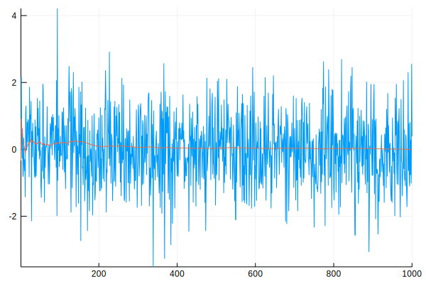
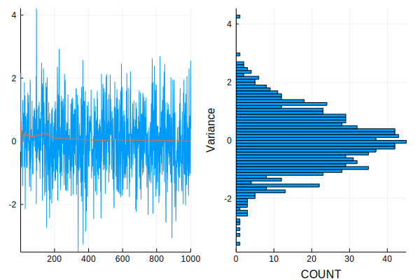

# Convergence diagnostics for MCMC_sampling

Moving Average Vector for Convergence


```julia
function MA(vec)
    """
    Calculate moving average of a vector and
    return the MA vector
    """
    xsum=zeros(length(vec))
    xma=zeros(length(vec))
    for xi in 1:length(vec)
        if xi!=1
            xsum[xi]=xsum[xi-1]+vec[xi]
            xma[xi]=xsum[xi]/xi
        else
            xsum[xi]=vec[xi]
            xma[xi]=vec[xi]
        end
    end
    return xma
end
```


    MA (generic function with 1 method)


```julia
using Distributions
using Plots 
gr()
function plot_MCMC_sample(mtx, title="", wcm_each=24, hcm_each=8)
    if typeof(mtx)!= Array{Float64,1}
        n,m = size(mtx)
    else
        mtx = hcat(mtx...)'
        n,m = size(mtx)     #converts an Array{Float64,1} to Array{Float64,2}
    end

    println(n,m)
	row = 1
	col = 1
	#qt = Int(round(n/4, 0))#println(collect(1:n))
	#posterior mean matrix
    
	actDim = Int(round(sqrt(2*m + 0.25), 0))
	pm0 = zeros(actDim, actDim)
    pleft_1, pleft_2 = [], []
    y_1, y_2 = [], []
    println(actDim, '\n', pleft_1, '\n', pleft_2)
	#for each column in the data
	for c in 1:m
		rlab = "$row"
		clab = "$col"

        m0 = round(mean(mtx[:,c]),2)
        pm0[row,col] = pm0[col,row] = m0

        if row == col
            ylab = "Var($rlab)"
            row += 1
            col = 0
        end
        col += 1
        
        push!(pleft_1,plot((collect(1:n)), MA(mtx[:,c])))
        push!(pleft_2,plot((collect(1:n)), mtx[:,c]))    
        push!(y_1, MA(mtx[:,c]))
        push!(y_2, mtx[:,c])
    end
    println("1: Length of pleft1 and y1", '\n', length(pleft_1), '\n', length(y_1))
    println()
    println("2: Length of pleft2 and y2", '\n', length(pleft_2), '\n', length(y_2))
    println()
    println("3: type of pleft1 and pleft2",'\n', typeof(pleft_1[1]), '\n', typeof(pleft_2[1]), '\n', typeof(y_1), '\n', typeof(y_2) )
    

    println("\n - Posterior mean 0 burn in:")
    println()
    println("4:", pm0)
    
    q = plot(histogram(nbins=100, y_2, legend = false, orientation = :h, xlabel = "COUNT", ylabel = "Variance"))
    #Plot histogram of counts for each y
    
    m = plot(collect(1:n), y_2, legend = false)
    r = plot!(m, collect(1:n), y_1, legend = false)  
    display(r)
    #Merge column value and column moving vector
    
    y_3 = vcat(y_1, y_2)
    println("5: The length of the concatenated vectors:", '\n', length(y_3))
        
    
    
    
    plot(r, q, layout =(1,2))
end
```


    plot_MCMC_sample (generic function with 4 methods)


```julia
mtx = randn(1000)

```


    1000-element Array{Float64,1}:
     -0.329498
      2.17202 
      0.216035
     -0.271598
      0.628633
     -0.820686
     -0.734683
      0.345875
     -0.386418
     -0.644618
     -0.295798
     -1.42507 
      1.07468 
      ⋮       
     -0.399564
      2.30094 
     -0.639353
      0.768935
     -0.945758
     -1.10181 
      0.816045
     -0.765741
      0.283858
     -1.0168  
      2.55011 
      0.395087


```julia
plot_MCMC_sample(mtx, "Graph")
```

    10001
    2
    Any[]
    Any[]
    1: Length of pleft1 and y1
    1
    1
    
    2: Length of pleft2 and y2
    1
    1
    
    3: type of pleft1 and pleft2
    Plots.Plot{Plots.GRBackend}
    Plots.Plot{Plots.GRBackend}
    Array{Any,1}
    Array{Any,1}
    
     - Posterior mean 0 burn in:
    
    4:





    [0.0 0.0; 0.0 0.0]
    5: The length of the concatenated vectors:
    2





